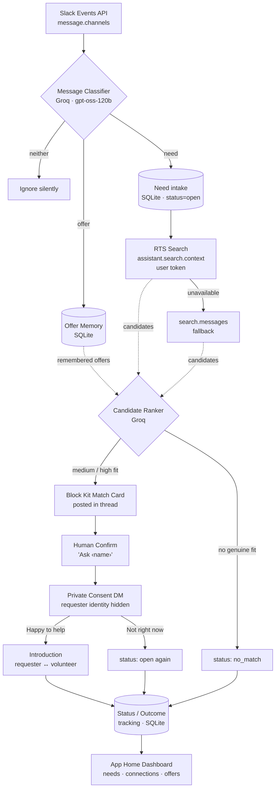

# Loop — Architecture

Loop is a single Bolt for JavaScript app running in Socket Mode. Everything below
happens inside one process; the only external calls are to Slack's Web API and to
Groq. The design is a straight top-to-bottom pipeline, with a consent-first state
machine governing the sensitive part — the human handoff.

## Top-to-bottom flow

1. **Slack Events API (`message.channels`)**
   Every top-level message in a channel the bot is in arrives via Socket Mode.
   Bot messages, edits, threads, and DMs are filtered out so only genuine
   community posts continue.

2. **Message Classifier (Groq)**
   The message text is sent to Groq (`gpt-oss-120b`) and classified as
   **need**, **offer**, or **neither**, returning structured JSON (skills,
   timing, location, language). "Neither" stops here, silently.

3. **Offer Memory (SQLite)**
   Offers are written to a local `offers` table (skills stored as JSON, plus
   the author, channel, timestamp, and age). This is Loop's persistent memory of
   who can help with what — it outlives the message scrolling away.

4. **Need intake (SQLite)**
   Needs are written to a `needs` table with a `status` field that acts as the
   state machine: `open → awaiting_consent → matched`, or back to `open` /
   `no_match`.

5. **RTS Search (`assistant.search.context`, user token)**
   For each need, Loop builds a query from its skills/timing/location and makes
   **one** Real-Time Search call against the community's real message history.
   If RTS is unavailable, it falls back to `search.messages`. Results + remembered
   offers are merged and de-duplicated per person.

6. **Candidate Ranker (Groq)**
   The need and the candidate list are sent to Groq, which returns up to three
   genuinely-fitting helpers, each with a confidence level, a short human reason,
   and offer age. Poor fits are omitted; if nothing fits, the need becomes
   `no_match`.

7. **Block Kit Match Card**
   If at least one candidate is a real fit, Loop posts a calm card as a threaded
   reply on the original need, suggesting the helper(s) with an "Ask ‹name›"
   button. **Nothing is auto-matched.**

8. **Human Confirm**
   A person clicks "Ask ‹name›". The card locks ("quietly checking…") so nobody
   else acts on it, and the need moves to `awaiting_consent`.

9. **Private Consent DM (identity hidden)**
   Loop opens a DM to the chosen volunteer and describes the need **without
   revealing who asked**. Two buttons: "Happy to help" / "Not right now". No
   pressure.

10. **Introduction**
    On "Happy to help", the need becomes `matched` and Loop posts a warm
    introduction in the original thread, tagging both people and stepping back.
    On "Not right now", the need returns to `open` and the volunteer is thanked.

11. **Status / Outcome tracking + App Home dashboard**
    Every transition updates the need's status and refreshes the **App Home**
    dashboard: open needs, recent connections, and offers on file.

## Key design choice

The LLM is used only for two narrow, verifiable jobs — **classify** and **rank**.
The actual matching *substrate* is the community's own Slack history, surfaced by
**Real-Time Search**. The "tool" isn't a search box; it's a **consent-first state
machine** that manages a sensitive human introduction safely.

## Mermaid flowchart

